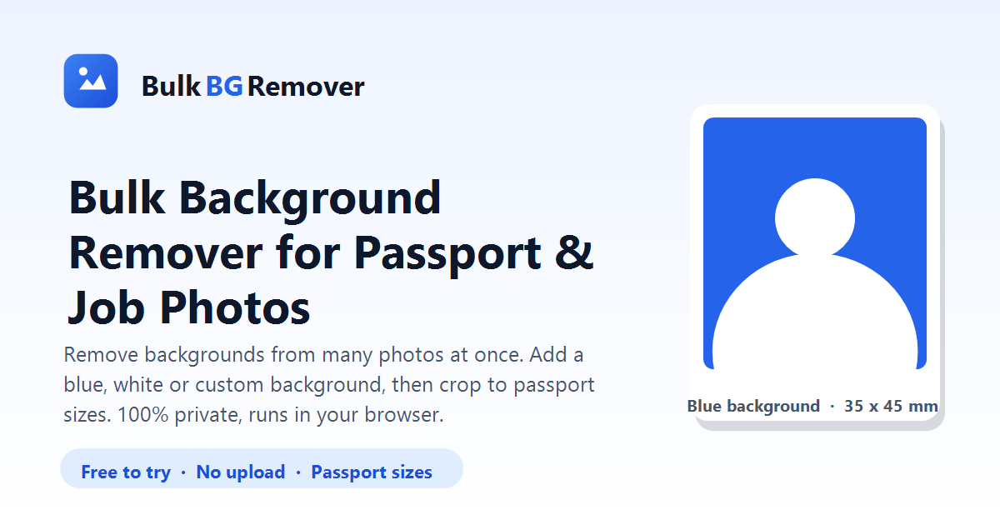

<div align="center">


# BulkBGRemover

### Remove backgrounds from **many photos at once** — entirely in your browser.

Add a solid **passport-blue / white / custom** background, auto-crop to **passport & visa sizes**, and download the whole batch as a **ZIP**.
No uploads. No servers. No watermark. Your photos never leave your device.

<br />


<br />

**[🚀 Live demo](https://bulkbgremover.netlify.app)**  ·  **[📖 Firebase setup](SETUP.md)**  ·  **[🐛 Report a bug](../../issues)**

<br />



</div>

---

## ✨ What it does

BulkBGRemover is a free web tool that removes the background from a whole batch of photos in one click, puts a clean solid color behind each subject, and crops to the exact passport/ID sizes people need for **school admissions and job applications** — a real, recurring problem for students in Pakistan and beyond.

Everything — including the AI — runs **inside the visitor's own browser**. There is no backend doing the image work, so photos are never uploaded and hosting stays free at any scale.

| | Feature |
|---|---|
| 🗂️ | **Bulk processing** — drop dozens of photos, remove all backgrounds at once |
| 🎨 | **10 color presets + custom picker** — passport-blue, white, red, gray, transparent… |
| 📐 | **Passport / visa sizes built in** — Pakistan 35×45 mm, NADRA, US 2×2 in, US Visa 600×600, Schengen, square, 3:4, and fully custom (px / mm / cm / in at 300 DPI) |
| 🎯 | **Auto-crop** — centers the subject and fits it to the chosen ratio |
| 🔒 | **100% private** — the AI runs on-device; **no image is ever uploaded** |
| 📦 | **Download all as ZIP** — or save photos individually |
| 🖼️ | **Live preview + lightbox** — change color/size/format and see results update instantly |
| 💾 | **Remembers your settings** — background, size, format and quality persist between visits |
| ⚡ | **Installable PWA** — works offline after the first visit |
| 💸 | **$0 servers** — a pure static site, free to host forever |

---

## 🧠 How it works

The heavy lifting — AI background removal — happens **in the user's browser** using [**Transformers.js**](https://github.com/huggingface/transformers.js) running the [**RMBG-1.4**](https://huggingface.co/briaai/RMBG-1.4) segmentation model. Because no server does the compute:

- **Hosting is just static files** → free forever on Netlify / Vercel / GitHub Pages / Cloudflare.
- **Cost never grows with traffic** → every visitor's own device does the work.
- **Photos stay private** → they never leave the device.

```
        ┌─────────────────────────── the visitor's browser ───────────────────────────┐
        │                                                                              │
  photo │   decode → RMBG-1.4 (Transformers.js)  →  alpha matte  →  composite on a     │  final
  ────► │   on WebGPU (fp16) or WebAssembly (q8)      (canvas)       solid background,  │  ─────► download
        │                                                            auto-crop, resize │  (PNG / JPG / ZIP)
        │                                                                              │
        └──────────────────────────────────────────────────────────────────────────── ┘
                         no network — nothing is uploaded
```

**First-run note:** the very first time someone uses the tool, the browser downloads the AI model once (**~40–90 MB**, depending on device), then caches it. Every run after that is instant — even offline. The engine automatically picks **WebGPU** (fast, fp16) when the device supports it, and falls back to multi-threaded **WebAssembly** (q8, ~44 MB) everywhere else.

---

## 🛠️ Tech stack

| Layer | Technology |
|---|---|
| **AI model** | [RMBG-1.4](https://huggingface.co/briaai/RMBG-1.4) by BRIA (non-commercial license) |
| **ML runtime** | [Transformers.js](https://github.com/huggingface/transformers.js) (Apache-2.0) |
| **Acceleration** | WebGPU (fp16) → WebAssembly (q8) automatic fallback |
| **UI** | Vanilla **HTML + CSS + ES-module JavaScript** — no framework, **no build step** |
| **Licensing gate** | [Firebase](https://firebase.google.com/) — Firestore + Email/Password Auth (Spark free plan) |
| **ZIP export** | [JSZip](https://stuk.github.io/jszip/) |
| **Offline / install** | Service Worker + Web App Manifest (PWA) |
| **Hosting** | Any static host — Netlify / Vercel / GitHub Pages / Cloudflare Pages |

> There is **no bundler and no `package.json`** — libraries load on demand from public CDNs (jsDelivr, Google). What you see is what runs.

---

## 🔑 Serial-key licensing (optional)

Editing and previewing are **always free**, and downloading a **single** photo is free too. Downloading **2 or more at once** requires a **serial key** — a lightweight way to support the project.

- An **admin panel** (`/admin.html`) lets the owner sign in, enter a person's name + phone, pick a duration (1 week → lifetime), and generate a random key bound to a unique user ID.
- Keys live in **Firestore**, but the **raw key is never stored** — only its SHA-256 hash — so the database can't leak usable keys or be enumerated.
- Each key **locks to the first device** that activates it (a browser fingerprint), which an admin can reset.

<details>
<summary><b>Is this bulletproof? (honest answer)</b></summary>

<br />

No — and that's by design. Because background removal runs **entirely in the browser**, the finished images already exist on the visitor's device. A JavaScript gate **stops normal users**, but a technical person can bypass it with dev tools. Truly unbypassable protection would need a paid server holding the images, which would break the free + private + in-browser design. For a school/portfolio tool, the deterrent is enough. Full reasoning is in [SETUP.md](SETUP.md).

</details>

> **The gate is off by default.** Until you configure Firebase (see below), the site works with downloads fully open.

---

## 🚀 Run locally

The app uses ES modules, so open it through a tiny local server (not `file://`).

```bash
# Option A — Node
npx serve .
```

```bash
# Option B — Python
python -m http.server 8000
```

Then open the URL it prints (e.g. `http://localhost:3000` or `http://localhost:8000`).

---

## ☁️ Deploy (free)

<details open>
<summary><b>Netlify — connect your GitHub repo (recommended)</b></summary>

<br />

1. Push this repo to GitHub (see below).
2. At [app.netlify.com](https://app.netlify.com) → **Add new site → Import an existing project → GitHub** → pick this repo.
3. Leave the build command **empty** and publish directory **`.`** — the included [`netlify.toml`](netlify.toml) already says "no build, just serve".
4. Deploy. You get a live HTTPS URL like `https://your-name.netlify.app`.
5. **Auto-deploy:** every `git push` to `main` re-publishes automatically.

</details>

<details>
<summary><b>Vercel</b></summary>

<br />

Import the repo at [vercel.com/new](https://vercel.com/new), framework preset **Other**, no build command, output directory **`.`**.

</details>

<details>
<summary><b>GitHub Pages</b></summary>

<br />

Push to GitHub, then **Settings → Pages → Deploy from branch → `main` → `/ (root)`**.

</details>

### After deploying
Set your real domain in these files (find-and-replace `https://bulkbgremover.netlify.app/`): [`index.html`](index.html) (canonical, Open Graph/Twitter, JSON-LD), [`robots.txt`](robots.txt), [`sitemap.xml`](sitemap.xml). If you already had the site live, bump `CACHE_VERSION` in [`sw.js`](sw.js) so returning visitors get the new files.

---

## ⚙️ Configuration (Firebase — only if you want the key gate)

The download gate + admin panel use the **Firebase Spark (free) plan** — no credit card. Follow the six steps in **[SETUP.md](SETUP.md)** to create the database, publish [`firestore.rules`](firestore.rules), enable Email/Password auth, create your admin account, and paste your web config into [`js/firebase-config.js`](js/firebase-config.js).

> ℹ️ The values in `firebase-config.js` are **not secrets** — they only identify your project and are safe in public code. Your data is protected by the security rules, not by hiding this config.

Also set the support email / WhatsApp shown in the key dialog: search for `SUPPORT_CONTACT` in [`js/app.js`](js/app.js).

---

## 📁 Project structure

```
.
├── index.html            # markup + SEO (title, meta, Open Graph, JSON-LD)
├── admin.html            # serial-key admin panel (Firebase Auth + Firestore)
├── tests.html            # in-browser unit tests for the pure functions
├── css/
│   └── styles.css        # design system — blue, responsive, accessible
├── js/
│   ├── app.js            # UI controller: upload, options, bulk flow, gate, ZIP
│   ├── bg-engine.js      # RMBG-1.4 via Transformers.js (loads once, WebGPU/WASM)
│   ├── image-utils.js    # canvas: alpha compositing, auto-crop, resize, export
│   ├── keys.js           # serial-key verification + device lock (Firestore)
│   ├── duration.js       # key-duration → expiry date math (unit-tested)
│   ├── admin.js          # admin panel logic (generate/list/manage keys)
│   └── firebase-config.js# Firebase web config + lazy SDK loaders
├── sw.js                 # service worker (offline app-shell, PWA)
├── site.webmanifest      # PWA manifest
├── firestore.rules       # Firestore security rules (paste into Firebase console)
├── netlify.toml          # "no build" hosting config + optional speed-up headers
├── robots.txt · sitemap.xml
└── favicon.svg · icons · og-image.png
```

---

## 🧪 Tests

Open **`/tests.html`** in a browser to run the unit suite (size math, expiry math, and canvas helpers). It renders a green/red pass list — currently **20 / 20 passing**. The page isn't linked from the app; open it directly.

---

## 🔐 Privacy

Your photos are **processed entirely on your device** and are **never uploaded** anywhere. The only data the optional key system stores in Firebase is your serial key (as a hash), a device fingerprint, and any name/phone an admin enters — **never your images**.

---

## 📜 License & attribution

- **App code** — © Umar Bhatti. You're welcome to learn from it and self-host.
- **RMBG-1.4 model** is licensed by **BRIA** under a **non-commercial** license ([model card](https://huggingface.co/briaai/RMBG-1.4)). This project is free and non-commercial, which is compatible.
  > ⚠️ **If you ever add ads or charge money**, you must buy a commercial license from BRIA **or** switch to a permissively licensed model (e.g. **MODNet** or **U-2-Net**, both Apache-2.0). The model is isolated in [`js/bg-engine.js`](js/bg-engine.js) to make that swap a one-file change.
- **Transformers.js** — Apache-2.0 · **JSZip** — MIT/GPL dual-licensed.

---

## 👤 Author

**Umar Bhatti** — Computer Science student at **COMSATS University Islamabad, Sahiwal Campus**.

Built to genuinely help students and job applicants get clean, correctly-sized passport photos without paying for editing tools or uploading private photos to a server.

<div align="center">
<br />
<sub>Made with ❤️ for students · Runs 100% in your browser · No photo ever leaves your device</sub>
</div>
